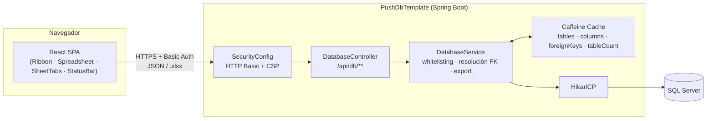

<div align="center">

# PushDbTemplate

**Explorador y auditor de bases de datos SQL Server con interfaz tipo hoja de cálculo**

[](#requisitos-previos)
[](#tech-stack)
[](#tech-stack)
[](#tech-stack)
[](#despliegue-con-docker)

</div>

---

## Resumen ejecutivo

**PushDbTemplate** es una aplicación web full-stack que expone, de forma **segura y de solo lectura**, el contenido de una base de datos SQL Server a través de una interfaz similar a Excel. Está pensada para equipos técnicos y de soporte (consultores, DBAs, analistas) que necesitan **inspeccionar datos de producción sin acceso directo al motor** ni herramientas de administración de base de datos.

El sistema resuelve automáticamente las relaciones entre tablas (Foreign Keys), permite definir relaciones virtuales cuando el modelo físico no las declara, y genera reportes `.xlsx`/`.csv` listos para distribuir — todo detrás de autenticación, con controles anti-inyección SQL y anti-exfiltración masiva.

**Valor de negocio:**

| Necesidad | Cómo la resuelve PushDbTemplate |
|---|---|
| Consultar datos sin dar acceso a SSMS/DBeaver | Interfaz web de solo lectura, sin superficie de escritura sobre las tablas de negocio |
| Entender relaciones sin conocer el modelo físico | Resolución automática de FKs + FKs virtuales configurables desde la UI |
| Entregar reportes a usuarios de negocio | Exportación `.xlsx` en streaming y `.csv` instantáneo |
| Auditar el estado del motor de base de datos | Consola de diagnóstico con métricas de tamaño, conexiones, colación, etc. |
| Cumplir controles de seguridad mínimos | Autenticación obligatoria, whitelisting de identificadores, CSP, límites anti-abuso |

---

## Índice

- [Características](#características)
- [Tech stack](#tech-stack)
- [Arquitectura](#arquitectura)
- [Requisitos previos](#requisitos-previos)
- [Configuración](#configuración)
- [Guía de uso](#guía-de-uso)
  - [Desarrollo local](#1-desarrollo-local)
  - [Build de producción](#2-build-de-producción-artefacto-único)
  - [Despliegue con Docker](#3-despliegue-con-docker)
- [Manual de la interfaz](#manual-de-la-interfaz)
- [Referencia de la API](#referencia-de-la-api)
- [Modelo de relaciones (Foreign Keys)](#modelo-de-relaciones-foreign-keys)
- [Seguridad](#seguridad)
- [Rendimiento y caché](#rendimiento-y-caché)
- [Observabilidad](#observabilidad)
- [Testing y calidad](#testing-y-calidad)
- [Estructura del proyecto](#estructura-del-proyecto)
- [Limitaciones conocidas](#limitaciones-conocidas)
- [Licencia](#licencia)

---

## Características

**Exploración de datos**
- Navegación paginada server-side (`OFFSET`/`FETCH NEXT`) de todas las tablas del esquema conectado.
- Selección dinámica de columnas visibles y proyección `SELECT` acotada (sin `SELECT *` innecesario).
- Descubrimiento automático de tablas vía `DatabaseMetaData`, excluyendo vistas y esquemas de sistema.

**Relaciones (Foreign Keys)**
- Detección automática de FKs reales del motor (`getImportedKeys()`).
- Resolución en **lote** (una consulta por columna FK, no por fila) del valor legible referenciado — sin problema N+1.
- FKs **virtuales/personalizadas**: define relaciones inexistentes a nivel de motor, con columna de visualización y filtro adicional, persistidas en base de datos (no en archivos locales).

**Exportación de reportes**
- `.xlsx` en streaming (Apache POI `SXSSFWorkbook`) con los valores de FK ya resueltos, límite de filas configurable y control de concurrencia.
- `.csv` instantáneo del lado del cliente, sobre la página actualmente cargada.
- Sanitización anti *Formula/CSV Injection* en ambos exportadores.

**Observabilidad y diagnóstico**
- Consola DBA embebida: motor, versión, tamaño en disco, colación, modelo de recuperación, conexiones activas, FKs virtuales configuradas.
- Endpoints de `Actuator` (`/health`, `/metrics`) para monitoreo externo.

**Seguridad by design**
- Autenticación HTTP Basic obligatoria (sin credenciales, la app no arranca).
- Whitelisting estricto de tablas/columnas contra la metadata real del motor antes de construir cualquier SQL.
- `Content-Security-Policy` restrictiva y API *stateless* (sin superficie CSRF).

**Rendimiento**
- Caché en memoria (Caffeine) para metadatos poco cambiantes.
- Pool de conexiones HikariCP afinado para SQL Server (prepared statements cacheados, `sendStringParametersAsUnicode` desactivado).
- Compresión HTTP de respuestas JSON/HTML/CSS/JS.

---

## Tech stack

| Capa | Tecnología |
|---|---|
| Backend | Java 21 · Spring Boot 4.1.1 (Web, Security, JDBC, Cache, Actuator) |
| Acceso a datos | `JdbcTemplate` + driver `mssql-jdbc` · HikariCP |
| Caché | Caffeine (`spring-boot-starter-cache`) |
| Reportes | Apache POI 5.3.0 (SXSSF streaming) |
| Frontend | React 19 · Vite 6 · `lucide-react` (iconografía) |
| Autenticación | Spring Security — HTTP Basic + `InMemoryUserDetailsManager` (BCrypt) |
| Contenedores | Docker multi-stage (Node 22 → Eclipse Temurin 21 JDK → Eclipse Temurin 21 JRE) |
| Persistencia de configuración | Tabla `dbo.push_custom_fks` en la propia base de datos destino |

---

## Arquitectura



- **Desarrollo**: el frontend corre en Vite (`:5173`) y hace *proxy* de `/api` hacia el backend (`:8080`) — ver [`frontend/vite.config.js`](frontend/vite.config.js).
- **Producción**: el build de Vite se copia dentro de `src/main/resources/static/`; Spring Boot sirve todo desde un único origen y puerto (sin CORS). [`IndexRedirectFilter`](src/main/java/com/LectorDBTemplate/PushDbTemplate/config/IndexRedirectFilter.java) evita que `/index.html` quede accesible como URL directa, normalizando siempre a `/`.
- **Estado compartido**: las FKs personalizadas viven en la tabla `dbo.push_custom_fks` de la propia base de datos destino, no en disco local — por lo que la aplicación es *stateless* a nivel de instancia y escala horizontalmente sin sesión pegajosa.

---

## Requisitos previos

| Herramienta | Versión | Necesaria para |
|---|---|---|
| JDK | 21 | Compilar/ejecutar el backend |
| Node.js / npm | 22+ | Compilar/desarrollar el frontend |
| SQL Server | Cualquier versión soportada por `mssql-jdbc` | Origen de datos |
| Docker | Reciente | Despliegue en contenedor (opcional) |

Se requiere además un **usuario de base de datos con permisos de lectura** sobre las tablas a explorar (y `CREATE TABLE` sobre `dbo` la primera vez, para que la aplicación pueda crear `dbo.push_custom_fks`).

---

## Configuración

Toda la configuración sensible se maneja por variables de entorno, cargadas desde un archivo `.env` en la raíz (`spring.config.import` en [`application.yaml`](src/main/resources/application.yaml)).

```bash
cp .env.example .env
```

| Variable | Obligatoria | Default | Descripción |
|---|---|---|---|
| `DB_URL` | No | `jdbc:sqlserver://localhost:1433;databaseName=CL3530BD01MAP;...` | Cadena JDBC de SQL Server |
| `DB_USERNAME` | **Sí** | — | Usuario de base de datos |
| `DB_PASSWORD` | **Sí** | — | Contraseña de base de datos |
| `DB_POOL_MAX_SIZE` | No | `10` | Tamaño máximo del pool HikariCP |
| `DB_POOL_MIN_IDLE` | No | `2` | Conexiones mínimas en espera |
| `APP_USER` | **Sí, sin fallback** | — | Usuario para autenticarse contra `/api/**` |
| `APP_PASSWORD` | **Sí, sin fallback** | — | Contraseña de `APP_USER` |
| `EXPORT_MAX_ROWS` | No | `50000` | Filas máximas exportables en un reporte `.xlsx` |
| `EXPORT_MAX_CONCURRENT` | No | `2` | Exportaciones `.xlsx` simultáneas permitidas |

> ⚠️ Si `APP_USER` o `APP_PASSWORD` no están definidos, la aplicación **no arranca** — es una decisión de diseño: nunca exponer la API sin protección en vez de degradar silenciosamente.

---

## Guía de uso

### 1. Desarrollo local

Backend y frontend corren como dos procesos independientes.

```bash
# Terminal 1 — backend (puerto 8080)
./mvnw spring-boot:run
```

```bash
# Terminal 2 — frontend (puerto 5173, con hot-reload y proxy hacia :8080)
cd frontend
npm install
npm run dev
```

Abre `http://localhost:5173`. El navegador solicitará las credenciales HTTP Basic (`APP_USER` / `APP_PASSWORD` de tu `.env`).

Scripts adicionales del frontend:

```bash
npm run lint      # Lint con oxlint
npm run build     # Build de producción → frontend/dist
npm run preview   # Sirve localmente el build de producción
```

### 2. Build de producción (artefacto único)

```bash
cd frontend
npm ci
npm run build
cd ..
cp -r frontend/dist/* src/main/resources/static/

./mvnw clean package -DskipTests
java -jar target/PushDbTemplate-0.0.1-SNAPSHOT.jar
```

La aplicación queda disponible en un único origen y puerto: `http://localhost:8080`.

### 3. Despliegue con Docker

El [`Dockerfile`](Dockerfile) automatiza el flujo anterior en una imagen multi-stage: build del frontend (Node 22) → build del backend con el frontend embebido (JDK 21) → runtime liviano (JRE 21) ejecutando como usuario sin privilegios.

```bash
docker build -t pushdbtemplate .

docker run -d \
  --name pushdbtemplate \
  -p 8080:8080 \
  --env-file .env \
  --restart unless-stopped \
  pushdbtemplate
```

**Notas para orquestación (Kubernetes / Docker Swarm / balanceadores):**

- *Readiness* y *liveness probe*: `GET /actuator/health` (no requiere autenticación).
- La app es *stateless* entre instancias — se puede escalar horizontalmente con múltiples réplicas sin afinidad de sesión.
- Ajusta `DB_POOL_MAX_SIZE` según el número de réplicas para no exceder el límite de conexiones del motor SQL Server.

---

## Manual de la interfaz

La interfaz emula el flujo de trabajo de una hoja de cálculo:

| Componente | Función |
|---|---|
| **Pestañas inferiores** (`SheetTabs`) | Una pestaña por tabla física del esquema (se excluyen vistas y esquemas de sistema). Clic para cargarla. |
| **Cinta de opciones** (`Ribbon`) | Selector de columnas visibles · filas por página y navegación · refrescar · exportar CSV/Excel · modo de visualización de FK (`id` / `real` / `ambos`) · abrir Consola DBA. |
| **Grilla principal** (`Spreadsheet`) | Datos paginados. Las columnas FK permiten crear, editar, habilitar/deshabilitar o eliminar una relación personalizada directamente desde la celda/encabezado. |
| **Barra de estado** (`StatusBar`) | Total de filas, rango mostrado y tiempo de respuesta de la última consulta. |
| **Consola DBA** (modal) | Motor y versión, driver JDBC, cadena de conexión (credenciales enmascaradas), estado/colación/modelo de recuperación de la BD, conexiones activas, tamaño en disco por archivo, FKs virtuales activas. |

---

## Referencia de la API

Todos los endpoints bajo `/api/db` requieren **HTTP Basic Auth**. `/actuator/health` es público.

### `GET /api/db/info`
Metadatos y estadísticas del motor conectado.

```json
{
  "databaseProduct": "Microsoft SQL Server",
  "databaseVersion": "15.00.4236",
  "jdbcUrl": "jdbc:sqlserver://localhost:1433;databaseName=***;user=******;password=******",
  "totalTables": 128,
  "totalViews": 14,
  "activeConnections": 6,
  "dbState": "ONLINE",
  "dbRecoveryModel": "SIMPLE",
  "dbCollation": "SQL_Latin1_General_CP1_CI_AS",
  "totalSizeMb": 4096,
  "dbFiles": [{ "name": "MiBD", "type": "ROWS", "sizeMb": 3072 }],
  "customFksCount": 7
}
```

### `GET /api/db/tables`
Lista de tablas legibles.

```json
[{ "schema": "dbo", "name": "Empresas" }, { "schema": "dbo", "name": "Proceso" }]
```

### `GET /api/db/tables/{schema}/{name}/columns`
Esquema de columnas de una tabla.

```json
[{ "name": "id_empresa", "type": "int", "size": 10, "nullable": false }]
```

### `GET /api/db/tables/{schema}/{name}/data?limit=&offset=&columns=`
Datos paginados (máx. **100** filas por llamada) + FKs de esa página ya resueltas.

```json
{
  "data": [{ "id_empresa": 1, "Empresa": 12 }],
  "totalRows": 5321,
  "limit": 15,
  "offset": 0,
  "currentPage": 1,
  "totalPages": 355,
  "fkColumns": [{ "column": "Empresa", "referencedSchema": "dbo", "referencedTable": "Empresas", "referencedColumn": "id_empresa", "displayColumn": "razon_social", "enabled": true, "custom": true }],
  "fkResolutions": { "Empresa": [{ "status": "RESOLVED", "value": "Acme S.A." }] }
}
```

### `GET /api/db/tables/{schema}/{name}/export?columns=`
Descarga un reporte `.xlsx` completo (streaming), con las FK ya resueltas.

### `POST /api/db/tables/{schema}/{name}/custom-fks`
Reemplaza el conjunto de FKs personalizadas de una tabla.

```json
[
  {
    "fkColumn": "Empresa",
    "referencedSchema": "dbo",
    "referencedTable": "Empresas",
    "referencedColumn": "id_empresa",
    "displayColumn": "razon_social",
    "filterColumn": null,
    "filterValue": null,
    "enabled": true
  }
]
```

**Ejemplo con `curl`:**

```bash
curl -u "$APP_USER:$APP_PASSWORD" \
  "http://localhost:8080/api/db/tables/dbo/Empresas/data?limit=15&offset=0"
```

**Códigos de error:**

| Código | Causa | Origen |
|---|---|---|
| `400` | Argumento inválido (ej. columna inexistente solicitada) | `IllegalArgumentException` |
| `403` | Tabla/esquema/columna fuera de la whitelist | `SecurityException` |
| `429` | Demasiadas exportaciones `.xlsx` concurrentes | `TooManyExportsException` |
| `500` | Error interno no controlado — se devuelve un `correlationId`; el detalle SQL/driver **nunca** se expone al cliente, solo queda en el log del servidor correlacionado por ese id | `Exception` genérico |

---

## Modelo de relaciones (Foreign Keys)

1. **FKs nativas**: detectadas leyendo `DatabaseMetaData.getImportedKeys()`. Las FK compuestas (más de una columna) se omiten — no se resuelven automáticamente.
2. **FKs personalizadas ("virtuales")**: se declaran desde la UI cuando el modelo físico no tiene el constraint, o para sobrescribir/deshabilitar una FK nativa. Se persisten en `dbo.push_custom_fks` (creada automáticamente al iniciar si no existe).
3. **Columna de visualización**, en orden de prioridad:
   1. `displayColumn` explícito de la configuración personalizada.
   2. Heurística automática: prioriza columnas típicas (`nombre`, `descripcion`, `razon_social`, `titulo`, `email`, …) y, si ninguna calza, la primera columna de tipo texto.
   3. Fallback: la propia columna referenciada.
4. **Migración legada**: si existe [`custom-fks.json`](custom-fks.json) en la raíz y `dbo.push_custom_fks` está vacía, su contenido se migra automáticamente a la base de datos al arrancar (una sola vez, sin borrar el archivo original).
5. **Resolución en lote**: por cada columna FK visible en una página se ejecuta **una** consulta `WHERE pk IN (...)` sobre los valores distintos de esa página — el costo depende del tamaño de página, no del tamaño de la tabla.

---

## Seguridad

| Control | Implementación |
|---|---|
| Autenticación | HTTP Basic obligatorio en `/api/**`; sin `APP_USER`/`APP_PASSWORD` la app no arranca (`SecurityConfig`) |
| Autorización | `/actuator/health` público · `/actuator/**` autenticado · `/api/**` autenticado · resto permitido (assets estáticos del SPA) |
| Inyección SQL | *Whitelisting* estricto: toda tabla/columna solicitada se valida contra la metadata real de la BD antes de construir cualquier SQL; identificadores escapados con corchetes (`[ ]`) estilo T-SQL |
| Formula/CSV Injection | Valores que inician con `=`, `+`, `-`, `@`, tab o CR se neutralizan con apóstrofe inicial — tanto en el export Excel del backend como en el CSV del frontend |
| CSRF | Desactivado por no aplicar: API *stateless*, sin cookies de sesión (`SessionCreationPolicy.STATELESS`) |
| Cabeceras HTTP | `Content-Security-Policy: default-src 'self'; script-src 'self'; style-src 'self' 'unsafe-inline'; img-src 'self' data:` |
| Exposición de errores | Excepciones no controladas devuelven mensaje genérico + `correlationId`; el stacktrace queda solo en el log del servidor |
| Exfiltración masiva | `EXPORT_MAX_ROWS` limita el tamaño de un reporte exportable |
| Agotamiento de recursos | `EXPORT_MAX_CONCURRENT` (semáforo) limita exportaciones simultáneas para no agotar el pool de HikariCP |
| Credenciales en tránsito | `jdbcUrl` expuesto en `/api/db/info` enmascara `user=`/`password=` antes de responder |
| Contenedor | Runtime Docker ejecuta como usuario sin privilegios (`appuser`), no como `root` |

> El transporte HTTPS/TLS y la exposición pública del servicio (reverse proxy, WAF, rotación de credenciales) son responsabilidad del entorno de despliegue — no están gestionados por la aplicación.

---

## Rendimiento y caché

- **Caffeine** cachea `tables`, `columns`, `foreignKeys`, `fkDisplayColumn` y `tableCount` con `expireAfterWrite=60s` y tamaño máximo de 200 entradas (ver [`application.yaml`](src/main/resources/application.yaml) y [`CacheConfig`](src/main/java/com/LectorDBTemplate/PushDbTemplate/config/CacheConfig.java)).
- Cabeceras `Cache-Control` del navegador para metadata (30s), alineadas con el TTL de la caché de servidor para no prometer más frescura de la que el backend garantiza.
- HikariCP afinado para SQL Server: `cachePrepStmts`, `prepStmtCacheSize=250`, `useServerPrepStmts=true`, `sendStringParametersAsUnicode=false`.
- Exportación `.xlsx` con `SXSSFWorkbook` (ventana de 100 filas en memoria + volcado a disco temporal comprimido) en vez de mantener el libro completo en RAM.
- Compresión HTTP habilitada para `application/json`, `text/html`, `text/plain`, `text/css` y `application/javascript` (umbral 1 KB).

---

## Observabilidad

| Endpoint | Acceso | Propósito |
|---|---|---|
| `GET /actuator/health` | Público | *Liveness/readiness probe* para orquestadores |
| `GET /actuator/metrics` | Autenticado | Métricas de la aplicación (JVM, HTTP, pool de conexiones, etc.) |

El nivel de detalle de `/actuator/health` se controla con `management.endpoint.health.show-details: when-authorized` — el detalle de los *health indicators* solo se expone a peticiones ya autenticadas.

---

## Testing y calidad

```bash
./mvnw test
```

| Test | Cubre |
|---|---|
| `PushDbTemplateApplicationTests` | Carga del contexto de Spring |
| `DatabaseControllerTest` | Endpoints REST, manejo de errores HTTP |
| `DatabaseServiceTest` | Lógica de paginación, whitelisting, exportación |
| `DatabaseServiceForeignKeyTest` | Detección y resolución de FKs nativas y personalizadas |

Lint del frontend:

```bash
cd frontend && npm run lint
```

---

## Estructura del proyecto

```
PushDbTemplate/
├── src/main/java/com/LectorDBTemplate/PushDbTemplate/
│   ├── PushDbTemplateApplication.java   # Entry point
│   ├── config/
│   │   ├── SecurityConfig.java          # HTTP Basic, CSP, stateless
│   │   ├── DatabaseConfig.java          # Hook de arranque (HikariCP vía application.yaml)
│   │   ├── CacheConfig.java             # @EnableCaching (aislado para no romper slice tests)
│   │   └── IndexRedirectFilter.java     # Normaliza /index.html → /
│   ├── controller/
│   │   └── DatabaseController.java      # Endpoints REST + manejo centralizado de errores
│   └── service/
│       └── DatabaseService.java         # Whitelisting, resolución de FKs, export .xlsx
├── src/test/java/...                    # Tests de controller y service
├── src/main/resources/
│   ├── application.yaml
│   └── static/                          # Build del frontend embebido (producción)
├── frontend/
│   ├── src/
│   │   ├── App.jsx                      # Estado global y orquestación de llamadas a la API
│   │   ├── components/                  # Ribbon · Spreadsheet · SheetTabs · StatusBar
│   │   └── utils/fk.js                  # Helpers de formato de resoluciones FK
│   └── vite.config.js                   # Proxy /api → localhost:8080 en desarrollo
├── Dockerfile                           # Build multi-stage (frontend + backend + runtime)
├── .env.example                         # Plantilla de variables de entorno
└── custom-fks.json                      # (legado) FKs personalizadas, migradas a BD al arrancar
```

---

## Limitaciones conocidas

- Las **FKs compuestas** (constraint sobre más de una columna) no se detectan ni resuelven automáticamente.
- La detección de tablas excluye explícitamente vistas y esquemas de sistema de SQL Server; no soporta otros motores (el driver y el SQL generado son específicos de T-SQL).
- La caché de metadatos tiene TTL fijo de 60s vía configuración; cambios de esquema en caliente pueden tardar hasta ese tiempo en reflejarse (o requieren reinicio/`evictCacheForTable`).
- No incluye un mecanismo de auditoría de "quién exportó qué" más allá de los logs de aplicación.

---

## Licencia

Este proyecto no declara actualmente una licencia de código abierto (`pom.xml` mantiene el bloque `<license/>` vacío). Consulta con el propietario del repositorio antes de redistribuir o reutilizar el código fuera de la organización.
